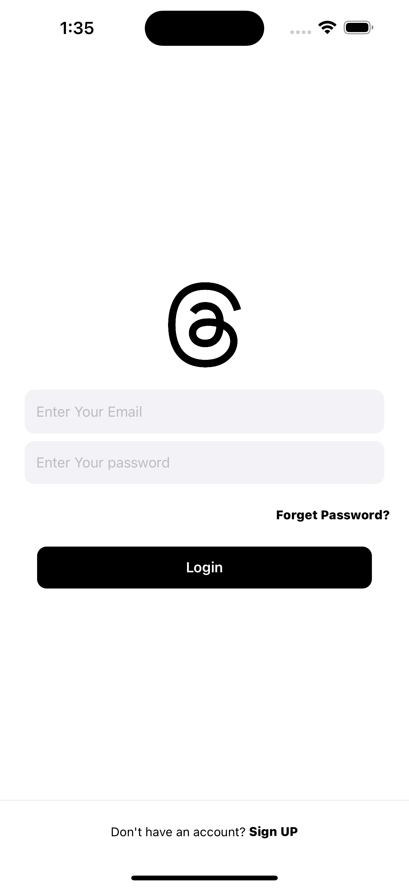
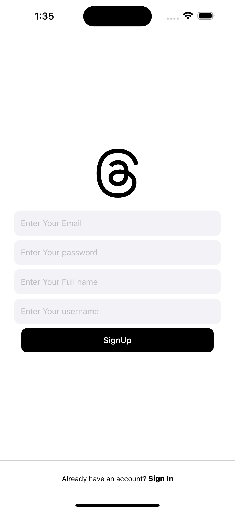
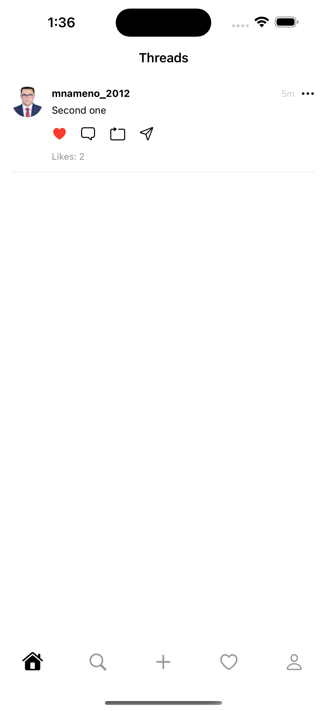
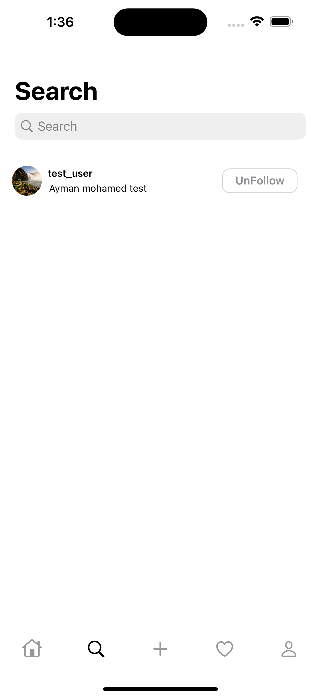
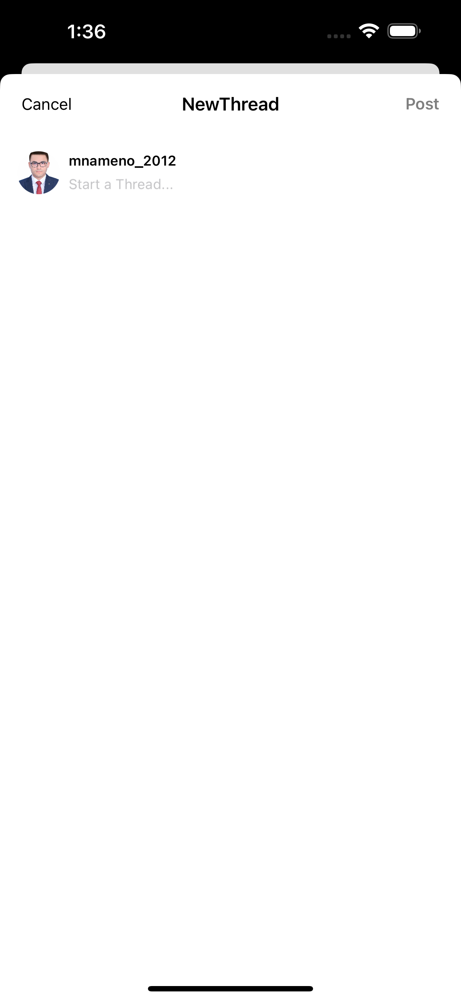
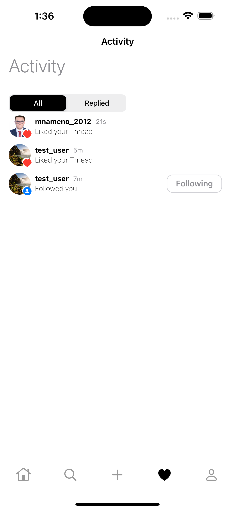
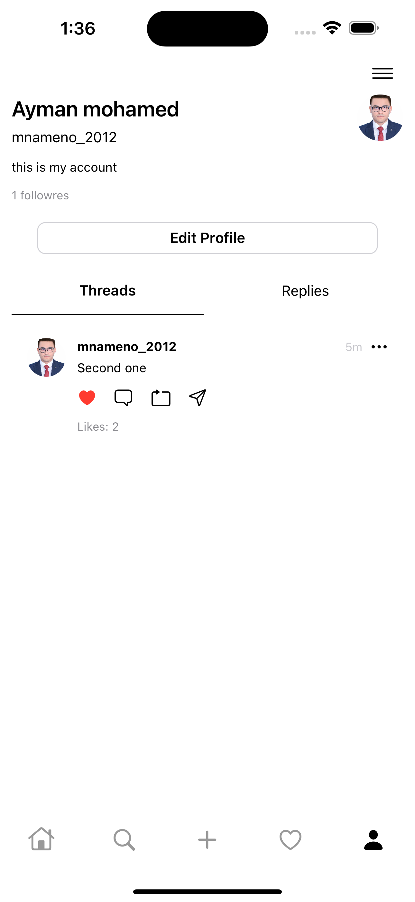
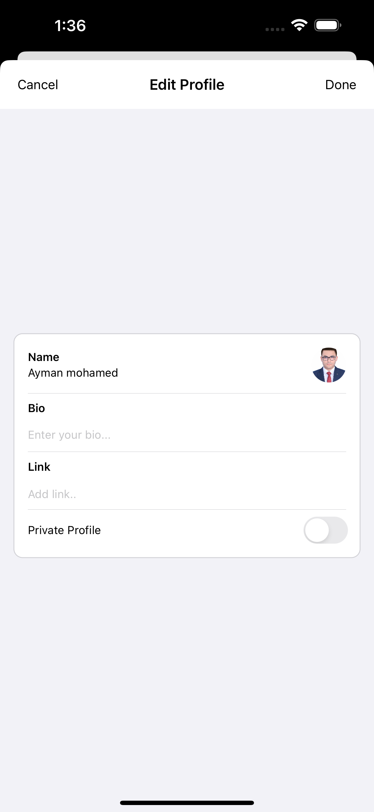
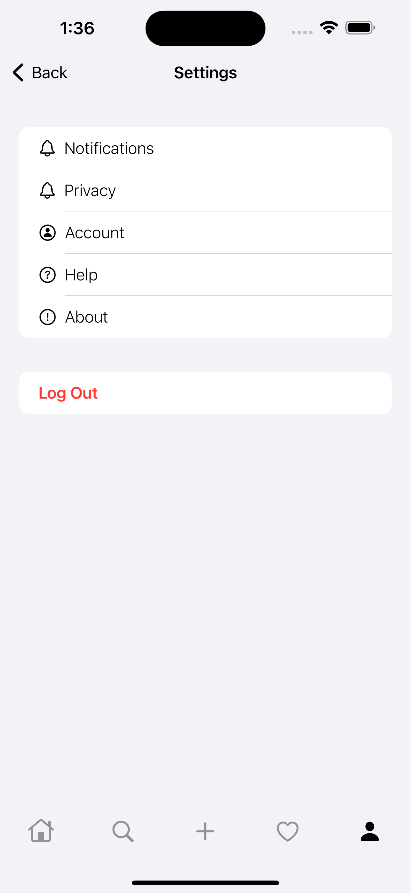

 # Thread application clone using swiftUI
<!-- Project Settings -->

 

<!-- Main Screenshot -->

    
    
    
    
    
    
    
    
    
    

<!-- Project bref -->
It is an clonning threads Application  .

<!-- ____________________________________________________________________________ -->
## Demo Video
### Thread application clone (User Demo)

<!-- ____________________________________________________________________________ -->

<!-- ____________________________________________________________________________ -->
## Features 
### Thread application clone (User App)

- Create an account emailand password 
- Sign In with email and password 
- Feed
  - users Posts which can interact with (Like,replay)
 - Explore
  - Search for any user 
- Thread Post 
  - Post athread to the your feed 
- Notfication
  - Show all notfiction of yours 
- Profile 
  - Show all your data(name , user name , bio , image )
  - can edit your profile information
  - show all your thread that is posted
- Setting
  - Log out
  - show privacy and terms

<!-- ____________________________________________________________________________ -->
## Dependencies
> Most of dependencies are installed using Cocoapods, and others installed using Swift Package Manager
- [Kingfisher](https://cocoapods.org/pods/Kingfisher)
- [Firebase](https://firebase.com/)

